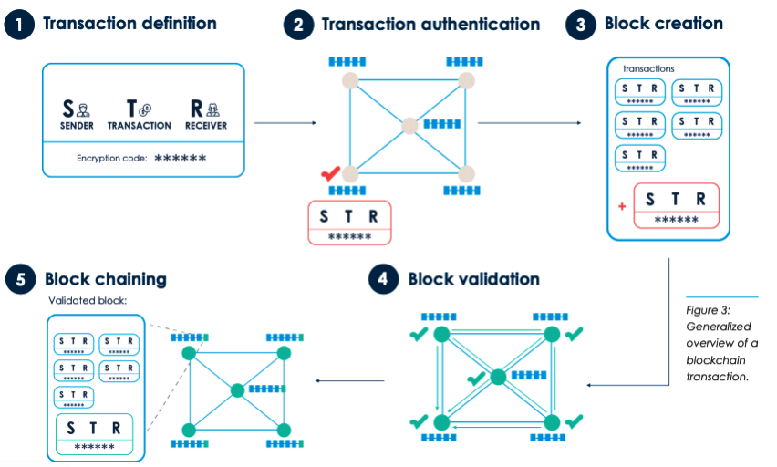
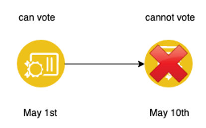
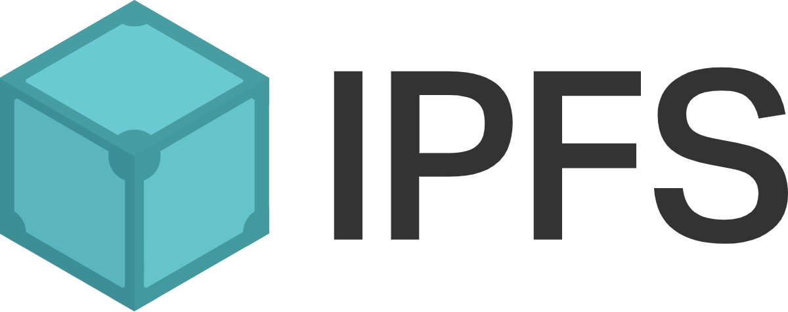
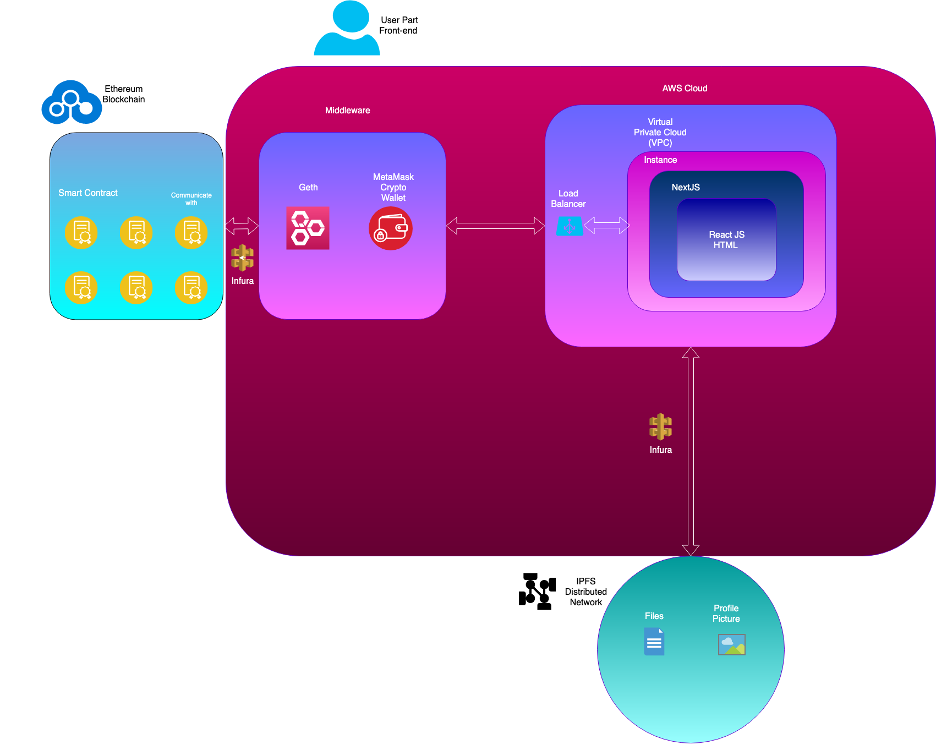

### The History of Blockchain

The concept of **decentralized digital currency** and alternative applications like property registries have been around for decades. The anonymous
e-cash protocols during the time of the 1980s and 1990s rely on a primitive method of (Kozłowski, 2012) cryptographic method and it conflicts
with the concept of decentralization because of its reliance on a centralized agent. Later in 2005, Hal Finney introduced a concept of a system
that solves crypto puzzles to create a concept for cryptocurrency but again failed because of its decency on trusted and selected computing 
network (Curran and Honan, 2006).

In 2009, **a decentralized currency** was for the first time implemented in practice by Satoshi Nakamoto, combining established primitives for
managing ownership through **public key cryptography** with a consensus algorithm for keeping track of the transactions and who exactly owns the 
coins and the number of coins, the algorithm is also known as **“Proof of work”** (explanation in details in later chapters) (Vashchuk and Shuwar, 2018).

---

### What is Blockchain?


Blockchain networks can be private with restricted membership similar to an intranet, or public, like the internet, accessible to anyone in the world. Users can trust the system of the public ledger stored online on many decentralized nodes maintained by ‘miners,’ rather than establishing and maintaining a trust relationship with another party.

In conclusion, Blockchain can be considered as a decentralized system where there is no third party involved in any of the transactions made. All peers on the Blockchain agree to the status and state of a transaction. Blockchain is a digital distributed yellow page where every transaction is recorded and saved. The transactions are then ordered and grouped into blocks. 

Currently, in the real world, most companies opt to serve a distributed ledger which serves as a single source of truth for all members that are using the Blockchain. Bashir stated that Blockchain is basically a chain of blocks that use hash pointers to point to the previous block (Bashir, 2017). Each transaction in the public ledger is verified by the consensus of a majority of the nodes in the Blockchain.

Once the transaction is being verified and recorded onto the Blockchain, the information can never be erased. This is where blockchain technology shines in modern days. It has the potential to revolutionize the digital world by enabling a shared ledger where each online transaction, past and present assets on the internet can be verified at any time. At the same time, the privacy of the transaction is assured as distribution and anonymity are the two most essential characteristics of the blockchain technology. (Umeh, 2018) 

---

### How Are New Blocks Added To The Blockchain
Once a transaction is defined, sender and receiver addresses (Addresses are used in a transaction as the unique identifier to denote senders and recipients on the Blockchain) are identified. (Hill, 2018) 

Secondly, a node starts a transaction by singing it with its private key by first authenticating the transaction to ensure its integrity. Thirdly, a block is created once the transaction is validated. After that, the new blocked added is integrated into the existing ledger and becomes a part of it as it links to another block with hash as identifiers.



The last step would be to validate the whole ledger again to ensure that every node in the Blockchain is updated. (Blockchain and Its Applications, 2017) The block validation is usually done by ‘Proof of work,’ a mechanism for validating transactions on the Blockchain which miners or network participants of the Blockchain compete to add the next transaction block to a blockchain by completing a cryptographic algorithm using computing powers, thereby earning transaction fees for their work. (Mir, 2017) 

The expressive power of Blockchain is further enhanced by the fact that Blockchain guarantees the accuracy of the time, i.e., a timestamp when a new transaction is made. The existence of such a trusted time in crucial for seeking fairness in any transactions. Especially, malicious users who may cheat the system by altering the timestamp is strictly prohibited. (Cachin, 2017)	

---

### Blockchain Sucessors - Ethereum

Blockchain technology does offer not only digital currencies such as Bitcoin but also other applications like distributed blockchain storage. Bitcoin is only one application that utilizes the blockchain technology and is the most popular implementation of blockchain technology. Blockchain is an ecosystem where allows developers to build applications within and around it.  

However, with the newly introduced Ethereum Blockchain platform, building decentralized applications become much faster instead of spending extra effort to build a complex background in coding, cryptography, and mathematics algorithms. 

> Ethereum blockchain offers developers with the tools required to build decentralization rapidly. Apart from that, Ethereum Blockchain intends to
> provide programming language for building smart contracts within the Blockchain. Ethereum Blockchain allows users to create digital asses to 
> represent custom currencies and financial instruments and other properties that can be traded in the platform. (Castiglione Maldonado, 2018)


---

### Smart Contract - Necessity

Organizations worldwide are losing millions to business email compromise (BEC) scams. The U.S. Securities & Exchange Commission recently
investigated a series of BEC attacks where hackers impersonated either a company executive or an outside vendor and convinced unwitting 
employees to wire money or pay invoices to accounts that the hackers controlled. In some cases, the victims had no idea they’d been tricked 
until the real vendor contacted them about the invoices being past due. Each organization lost at least $1 million, and two lost more than $30 
million. 

Smart contracts, also known as self-executing contracts, blockchain contracts, or digital contracts, will help prevent these types of BEC scams. Smart contracts are embedded with an if-this-then-that (IFTTT) code that automatically executes the contract’s terms once its conditions are met; for example, once a vendor completes work or delivers goods to a buyer, the vendor is automatically paid, and changing the payment account data would require validation from the entire chain. (Catchlove, 2017)

---

### Coding Smart Contract - Solidity

> Solidity is a new programming language for writing programs for Ethereum Smart Contracts, which compiles into byte codes and runs by the EVM
> (Ethereum Virtual Machine).

It is an object-oriented, high-level functional language that is inspired by C++, and JavaScript. It is also statically typed, class inheritance supported and other features such as user-defined types and so on. With Solidity, the developer can easily create contracts for Ethereum Blockchain, for example, voting, crowdfunding, blind auctions, and digital wallets.  

```solidity
contract HelloWorld{
    function sayHello() public returns (string)
    {
        return ("Hello World!");
    }
}
```

### Contract Self-Destruction - Solidity

Solidity allows contracts to **remove their codes from the blockchain** with the help of Self-Destruction functions. The remaining Ether stored in the contract return to a designated address, and the contract is disabled, but the history of the contract still exists on the Ethereum Blockchain. 

The use of the Self-Destruction function demonstrates that once the voting deadline passes, the contract automatically destroys itself and becomes unusable in the scenario of a voting app. Still, the votes the contract gathered remain on the Ethereum Blockchain. Furthermore, the Self-Destruction function can **prevent people from continually adding votes to a specific party to cheat the voting**.



---

### Distributed File Sytem - IPFS

The Interplanetary File System is a peer-to-peer distributed file system that seeks to connect all computing devices with the same system of files. In other words, IPFS is similar to the Worlds Wide Web, but in a decentralized way.

IPFS seeks to create a permanent and distributed web. It does this by using a content-addressed system such as a request like ``` /ipfs/QmT5NvUtoM5n/folder/file.txt. ``` Instead of using an URL location, IPFS uses a representation of the content itself to name the address of the content. This is done by implementing a cryptographic hash on a file that is used as the address. 

The hash represents the root of the file and other files which are linked to the parent file. This process skips the need of talking to a server, and gains access to the file directly. If a node is close to the user and has the file that the user requests, the user can receive the file from them instead of a central server. 



To store data, IPFS uses a Distributed Hash Table. Once the requesting client has a hash, the peer network who has the content located at that hash and provide access to download the content directly from the node that has the data the client is requesting for. Data is transferred between the nodes in the network using mechanisms like BitTorrent. The client is looking for some content on the IPFS web finds neighbors who have access to that content. They then download small bits of the content from those neighbors. 

On top of the DHT and the BitTorrent protocols, IPFS uses a Merkle Tree. This is a data structure similar to the one Git uses as a version control system and the protocol used in the bitcoin blockchain. In Git, it is used to track versions of source code, whereas in IPFS it’ is used to track content across the entire web. (Labs, 2016)


### Medichain System Architecture

#### 1. Illustration Of The System


##### 2. AWS Cloud
The ReactJS renders the HTML code and displays it to the user, and then NextJS serves the front-end in a local web server that exists in an Amazon Web Service instance. The instance resides in a virtual private cloud on the Amazon Web Services Platform. Any request to MediChain needs to pass through a load balancer on the Amazon Web Services first, so it does not overload the server.

##### 3. Middleware
The MetaMask Ethereum wallet binds the data it received from MediChain and transport it to the Ethereum Network with the help of Geth transmitting RPC requests. Therefore, the transaction, with the data, is successfully sent to the Ethereum Blockchain. The middleware is the layer where the system process transaction in the back-end until the transactions reach the Ethereum Blockchain.

##### 3. Ethereum
The smart contract exists in the Ethereum Blockchain and contains the immutable code that supports the back-end logic for MediChain. Smart contract receives function calls from the user part and processes the data then store it on the Blockchain stack. 

##### 4. IPFS Storage
The IPFS Distributed Networks waits for the file uploading from the local peer that exists in the NextJS server. Once the NextJS submits a file, the IPFS distributed network accepts the bytecodes of the file and keeps it in the distributed network, then returns a timestamp and a unique hash to identify and locate the file in IPFS. 

##### 5. Doctor Registration Scenario
A case scenario is provided based on Doctor Registration to explain further how various components in MediChain work as a whole. At first, the user types in the URL of MediChain, it first travels through AWS cloud load balancer to the virtual private cloud then locates the instance within the VPC and finally reaches the NextJS server that listens for incoming connection to MediChain. 

MediChain displays the registration page built with ReactJS and HTML, and when the user submits the registration form and clicks to confirm the transaction in MetaMask wallet, the NextJS server that hosts the ReactJS front end submits the information to Geth. Geth then sends RPC requests through infura API gateway to the Ethereum Blockchain. Once the Ethereum Blockchain receives the request from MediChain, it locates the smart contract that the request is trying to access and runs the requested function **insertDoctor()** in that smart contract.  

In this case, it is the doctor smart contract. On the other hand, the profile picture submitted by the doctor is uploaded to IPFS, and this step is processed by the NextJS server and gets a return unique hash identifier that MediChain submits to the Ethereum Blockchain along with other data.

### Wireframes

##### 1. Home Page


##### 2. About Page


##### 3. Get Started Page


##### 4. Patient Registration Page


##### 5. Patient Profile Page

